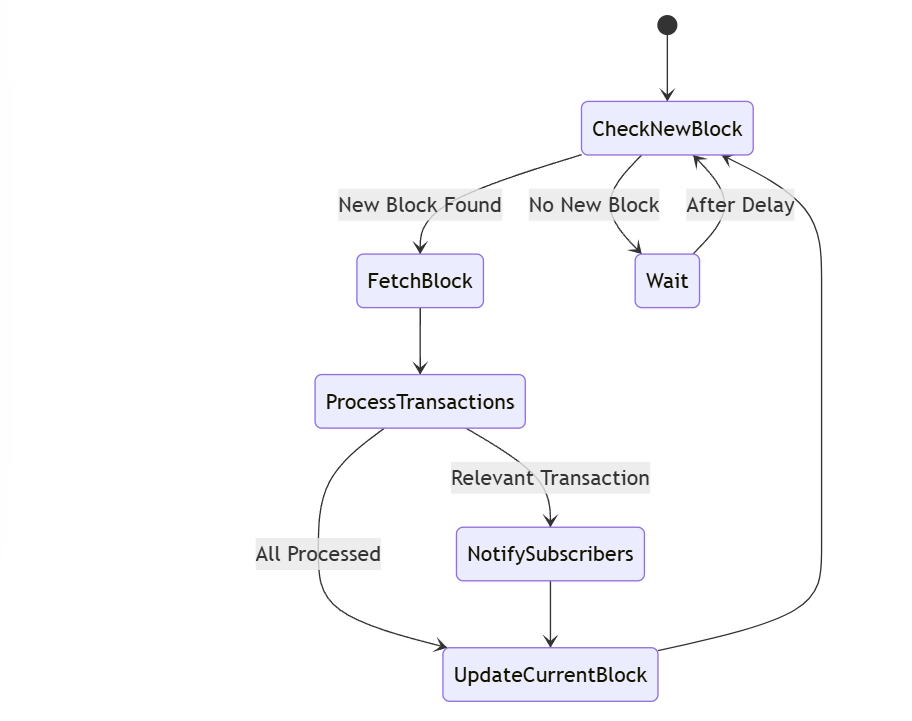
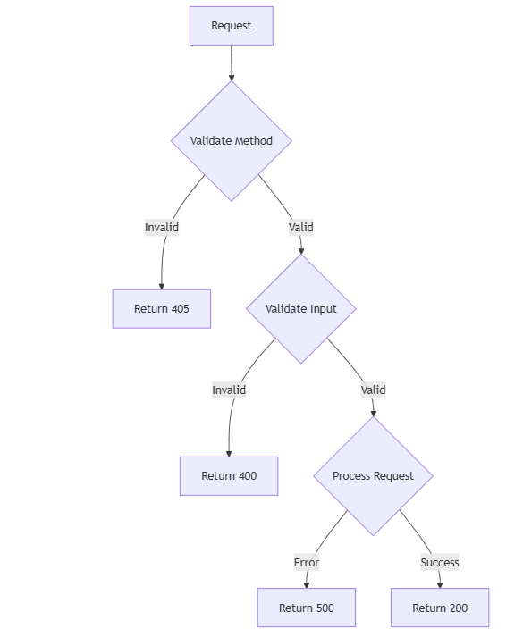

# Ethereum Blockchain Transaction Monitor

A Go-based application for monitoring Ethereum blockchain transactions with real-time notifications.

## Features
- Monitor incoming/outgoing transactions
- Subscribe to multiple addresses
- Query historical transaction data
- Real-time console notifications
- REST API endpoints

## Architecture

### Component Architecture


The system consists of:
- API Layer: Handles HTTP endpoints
- Monitor: Tracks blockchain blocks
- Parser: Processes transactions
- Storage: In-memory data management
- Notification: Console alerts

### Monitor Flow


Monitors new blocks and extracts transactions matching subscribed addresses.

### Error Handling


Implements comprehensive error handling across components.

## API Endpoints

- `GET /currentBlock`: Latest block number
- `POST /subscribe?address=0x...`: Subscribe to address
- `GET /transactions?address=0x...`: Get address transactions
- `GET /subscribers`: List subscribed addresses

## Configuration

```env
RPC_ENDPOINT=http://127.0.0.1:7545
SERVER_HOST=0.0.0.0
SERVER_PORT=8000
LOG_FILE_PATH=/app/logs/blockchain-parser.log
ENVIRONMENT=development
MONITOR_DELAY=5

```


## Testing

### Prerequisites
1. Running Ganache instance with saved state
2. Blockchain parser running (`go run cmd/main.go`)

### Test Scripts
```bash
# Run test transactions 
go run Tx_transaction/transaction.go

# Verify transactions via API
curl "http://localhost:8000/transactions?address=0xdD93e92dc32d0B2F51430b0e6dA29BDd01AF68D6"
```


## Test all parts

1 add sender address and privateky and reciever addresses to transactions.go
2 upadte values in run.sh for addresses
3 ./run.sh


## Etherium JSONRPC Test
replace url with etherium jsonrpc url or update same  in .env file 


# Project structure

```bash
├── cmd/
│   └── main.go
├── internal/
│   ├── api/
│   ├── logger/
│   ├── monitor/
│   ├── notification/
│   ├── parser/
│   ├── storage/
│   └── utils/
├── config/
├── Dockerfile
├── .env.sample
└── README.md
```

# Constraints
- Ethereum-compatible RPC endpoint
- Valid Ethereum addresses only
- In-memory storage
- Single process architecture
- No external dependencies
